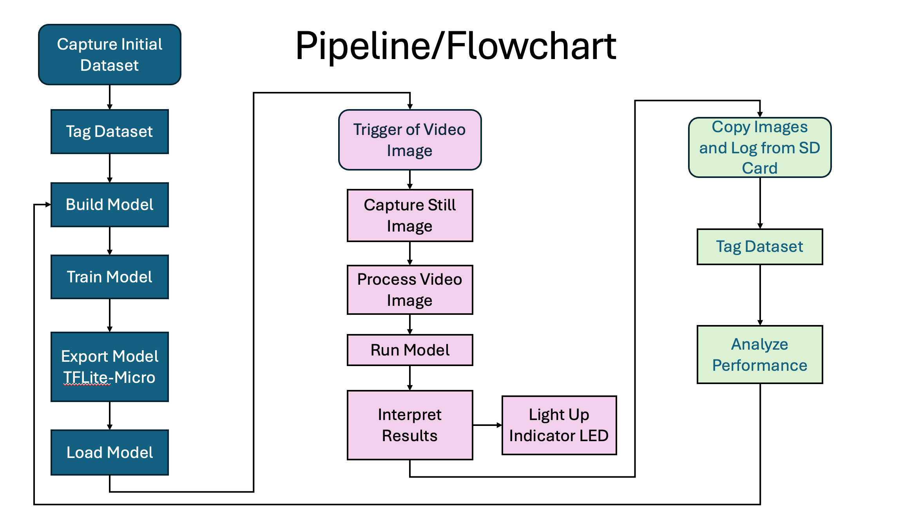

sqVB1rd (Squirrel Vs Bird) was developed for <a href="http://sfsu-miclab.org/wp-content/uploads/2023/02/ENGR859-On-Device-Machine-Learning-Flyer.pdf">ENGR 845</a> (On-Device Machine Learning) at SFSU

The idea of the project, and the class, is to train and run a machine learning model on small hardware... No, smaller than that.
The hardware I chose?
A NVIDA Jetson perhaps? Lightweight, but an (almost) identical pipeline as my desktop... No, that would be silly.
Ok, how about a Raspberry PI? A modifyed pipleine, but all the support in the world. Pffft. Why would I wan't support and documentation.

No, I think we should do this with the <a href="https://developer.sony.com/spresense/development-guides/introduction_en.html">Sony Spresense</a> And lets do a vision based project! Yeah, 1.5MB, no GPU and 156MHz ARM Cortex M4... That is a perfict first machine leaning project!
Also, you would think by now I would be able to spell "Spresense" without looking it up, or "Squirrel" for that matter. 
 
Where was I? Oh, yes, sqVB1rd (Squirrel versus Bird) <a href="media/IMG_6636_finalRun_720.mov">detects if a nasty old squirrel is at the bird feeder again</a>. And then, er, vigerously blinks an LED at him... And takes a picuture... er, for you download later. I suposed hooking up water feature would be the next step. But I will leave that to a Mechanical Engineer (er, yes, I supose I should mention at this point that I am, yes, tecnicly a mechanical engineer. I only mean that I have a degree in mechanical engineering, am licensed as a P.E. in Machine Design, have worked for 15 years in instrementation and robotics, and am currently seeking a Masters in Mechanical Engineering). Anyway, words are boring... Heres another picture:

