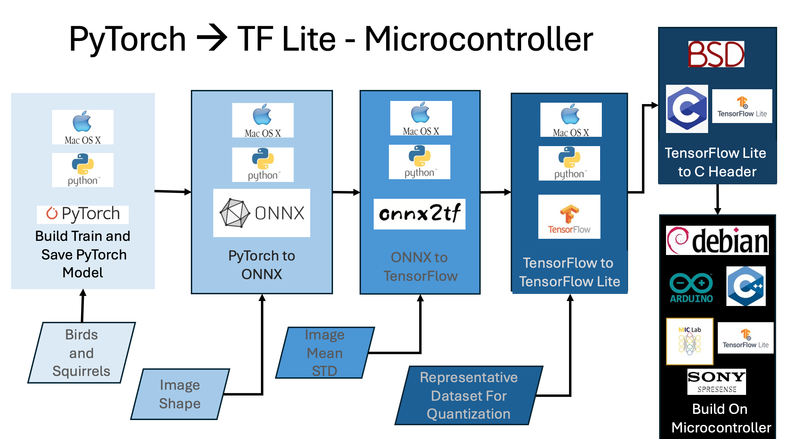
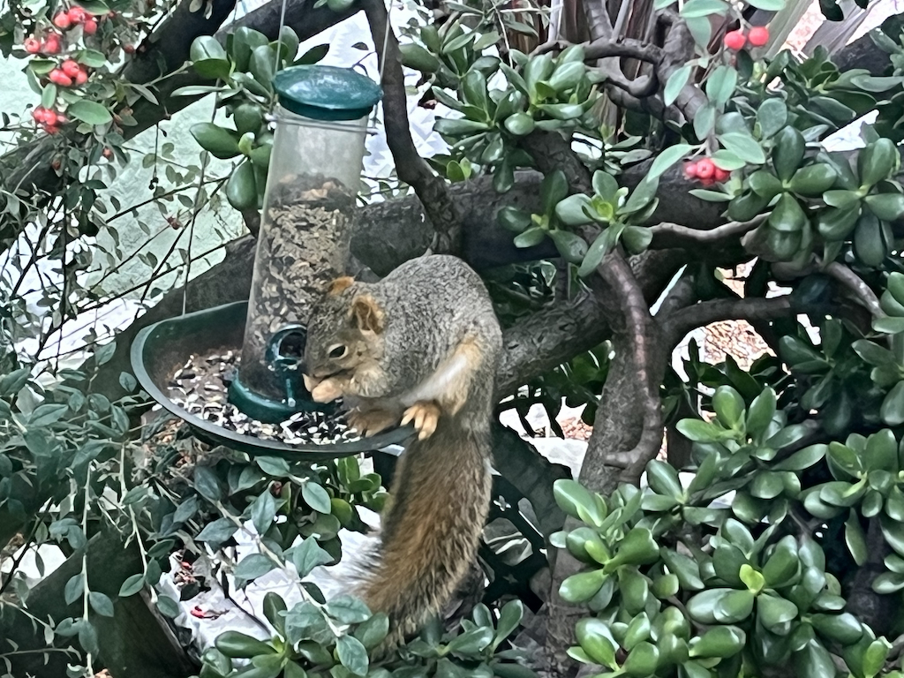

sqVB1rd (Squirrel Vs Bird) was developed for <a href="http://sfsu-miclab.org/wp-content/uploads/2023/02/ENGR859-On-Device-Machine-Learning-Flyer.pdf">ENGR 845</a> (On-Device Machine Learning) at SFSU

The idea of the project, and the class, is to train and run a machine learning model on small hardware... No, smaller than that.
The hardware I chose?
A NVIDA Jetson perhaps? Lightweight, but an (almost) identical pipeline as my desktop... No, that would be silly.
Ok, how about a Raspberry PI? A modified pipeline, but all the support in the world. Pffft. Why would I wan't support and documentation.

No, I think we should do this with the <a href="https://developer.sony.com/spresense/development-guides/introduction_en.html">Sony Spresense</a> And lets do a vision based project! Yeah, 1.5MB, no GPU and 156MHz ARM Cortex M4... That is a perfect first machine learning project!
Also, you would think by now I would be able to spell "Spresense" without looking it up, or "Squirrel" for that matter. 
 
Where was I? Oh, yes, sqVB1rd (Squirrel versus Bird) <a href="media/IMG_6562_detecteSq_1080p.mov">detects if a nasty old squirrel is at the bird feeder again</a>. And then, er, vigorously blinks an LED at him... And takes a picture... er, for you download later. I suppose hooking up water feature would be the next step. But I will leave that to a Mechanical Engineer (er, yes, I should probably mention at this point that I am, yes, technically a mechanical engineer. I only mean that I have a degree in mechanical engineering, am licensed as a P.E. in Machine Design, have worked for 15 years in instrumentation and robotics, and am currently seeking a Masters in Mechanical Engineering). Anyway, words are boring... Heres another picture:

The big bite, shockingly enough, is getting a model small fast and accurate. Did I succeed? No. No, I did not. But I did get it small, slow and functional! So, lets use that... er... Uh
Oh, I know, distraction! Here is another picture

"Wow I just took a look at the src folder, thats a lot of files and junk... What to they all do?"
I'm so glad you asked, it's rather simple:

|Module|Hardware/OS/Platform|File|Language|
|:-----|:--------------------:|:----:|--------:|
|RealTime| Sony Spresense/Arduino | sqVB1rd\_ard.ino | C++|
|RealTime Model | TensorFlow Lite | RGB2BGRleNetV5\_trained.h | C Header |
|RealTime Serial Image Diaplay | <a href="https://processing.org">Processing</a> | processingScript.pde | Java |
|Image Capture/First Attempt at RealTime | Sony SpreSense/SDK | sqb_main.c, camera.c, camera.h, cardUtils.c, cartdUtils.h, DSC.config   | C |
|Data Augmentation |  torchvision | DataAugment.py | Python |
|Image Loading | TorchVision | DataPreparation.py | Python |
|Convert Image | CV2 | <a href="https://github.com/MIC-Laboratory/On-Device-Computer-Vsion-CNN">BGR2RGB565.py</a> | Python|
|Rename Images | OS | fileOpps.py | Python |
|Model Training | PyTorch | main.py | Python |
|Model Training | PyTorch | Model.py | Python |
|Model Definition | PyTorch | Trainer.py | Python |
|Model Converting | Super Simple | saveModel.py | Python |
|Model Optimization | MIC Pruning Engine | optimize.py | Python |
|Model Validation | Tensor Flow | RunTfLite.py | Python |
|Model Validation | PyTorch | validate.py | Python|
|Data Analysis | Torch Metrics/SSklearn | analysis.py | Python |
|Model Analysis | thop | OpCounter.py | Python |

Whats that? You want more details? Some sort of <a href="ENGR859_jMehlman_Machine_Learning_Image_Based_Pest_Species_Identification.pdf"> report</a> even? No, sorry, don't have nothing like that.

I do have a bunch of blurry, low resolution pictures of squirrles though.

